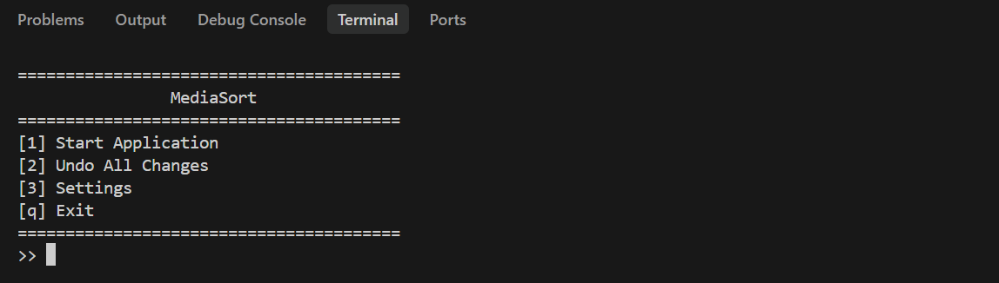
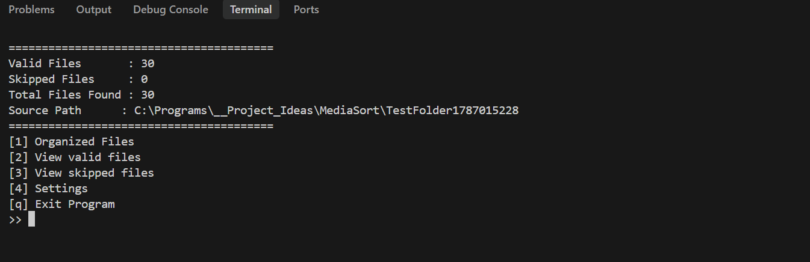
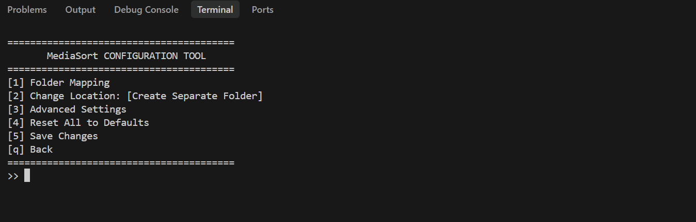
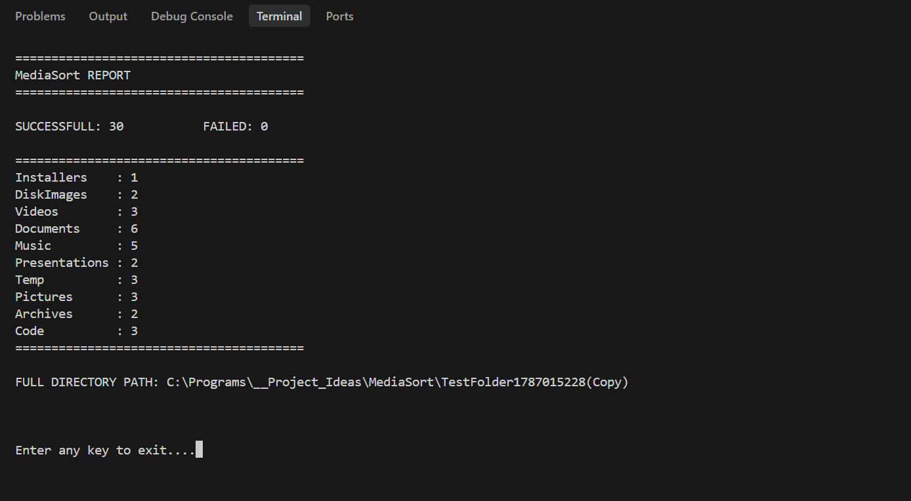

<div align="center">

# MediaSort

<p align="center">
  
</p>

[](#)
[](#)
[](#)

**A CLI tool that automatically organizes your files into categorized folders, keeping your directories clean and clutter-free.**

[Report a Bug](https://github.com/Huerte/MediaSort/issues) · [Request a Feature](https://github.com/Huerte/MediaSort/issues)

</div>

---

<p align="center">
  MediaSort provides a command-line environment designed for automated file organization. Built to be fast, flexible, and safe.
</p>

---

## Table of Contents

- [Installation Guide](#installation-guide)
- [What It Does](#what-it-does)
- [How It Works](#how-it-works)
- [Usage](#usage)
- [Configuration](#configuration)
- [Contributing](#contributing)
- [Contributors](#contributors)
- [License](#license)

---

## Installation Guide

Follow these steps to install MediaSort locally. There are two ways to get MediaSort. Pick whichever fits you.

### Option A: Download the Executable (Recommended)

*Currently not available. Please build from source.*

### Option B: Build from Source (For developers)

**Prerequisites:**

| What you need | Where to get it |
|---------------|-----------------|
| Python 3.x    | [python.org](https://www.python.org/downloads/) |
| Git           | Already on your machine |
| `tkinter`     | (Linux only) for folder selection dialogs |

**Steps:**

1. Clone the repository:
   ```bash
   git clone https://github.com/Huerte/MediaSort.git
   cd MediaSort
   ```

2. Install Dependencies:
   *No external dependencies required for Windows.*

   For **Linux** users, install `tkinter`:
   ```bash
   sudo apt-get install python3-tk
   ```

3. Run the application:
   ```bash
   python src/main.py
   ```

---

## What It Does

MediaSort automates the painful process of manually sorting your files.

| Feature | What it means |
|---------|---------------|
| **Automated Organization** | Sorts files into predefined categories like Music, Videos, Pictures, Documents, and more based on file extensions. |
| **Customizable** | Add or remove file extensions and folder categories via the built-in settings menu. |
| **Undo Functionality** | Reverts the last sorting operation if the result is not satisfactory. |
| **Deep Search** | Recursively scans and sorts files through subfolders for thorough organization. |
| **Safety Controls** | Handles duplicate file names with support for "Safe Mode" (Copy) or "Move" operations. |
| **Cross-Platform** | Works on both Windows and Linux. |

---

## How It Works

**Project structure:**

```text
MediaSort/
├── src/
│   ├── core/           # Core logic for organization
│   ├── utils/          # Helper utilities (file ops, settings, UI)
│   └── main.py         # Entry point
├── config.json         # User configuration (generated on first run)
├── .gitignore
└── README.md           # This file
```

---

## Usage

1. Run the main script with `python src/main.py`.

<p align="center">
  <br>
  
  <br>
</p>

2. **Start Application** — Select the target folder you want to organize. The tool will scan and display the valid files found.

<p align="center">
  <br>
  
  <br>
</p>

3. **Undo All Changes** — Revert the last organization operation.
4. **Settings** — Configure folder mappings, file extensions, and advanced options.

<p align="center">
  <br>
  
  <br>
</p>

5. **Sorting Report** — After organizing, the tool will automatically display a final summary report of successful and failed operations.

<p align="center">
  <br>
  
  <br>
</p>

---

## Configuration

Edit the generated configuration file:
```bash
config.json
```

Example:
```json
{
  "categories": {
    "Music": [".mp3", ".wav", ".flac"],
    "Videos": [".mp4", ".mkv", ".avi"]
  }
}
```

---

## Contributing

Contributions are welcome. Here is how to go from zero to a submitted pull request.

### Getting Started

**Prerequisites:** Python 3.x and Git.

**Fork and clone:**

```
# 1. Fork the repo on GitHub, then clone your fork
git clone https://github.com/YOUR_USERNAME/MediaSort.git
cd MediaSort

# 2. Keep your fork in sync with the original
git remote add upstream https://github.com/Huerte/MediaSort.git
```

### Making Changes

**Branch naming:**

```
feat/short-description    # New features
fix/short-description     # Bug fixes
docs/short-description    # Documentation only
chore/short-description   # Maintenance or refactoring
```

**Commit messages:** Use plain English. Describe what changed and why:

```
# Good
git commit -m "feat: add support for deep directory scanning"
git commit -m "fix: resolve duplicate file handling error"
git commit -m "docs: clarify installation steps in README"

# Avoid
git commit -m "fix stuff"
git commit -m "update"
```

**Code style:**

- Follow the existing patterns in the `src/` directory.
- Keep functions short. If something is growing, split it.
- Add a comment when the purpose of something is not immediately obvious.
- Never swallow exceptions silently with a bare `except: pass` unless the operation is purely cosmetic.

### Submitting a Pull Request

1. Push your branch to your fork:
   ```
   git push origin feat/your-feature
   ```

2. Open a Pull Request against `Huerte/MediaSort:main` on GitHub.

3. In the PR description, briefly explain: what you changed, why, and how to test it.

4. If your change affects the app's output or behavior, update this README accordingly.

---

## Contributors

<div align="center">
  <table>
    <tr>
      <td align="center"><a href="https://github.com/Huerte"></a><br /><a href="https://github.com/Huerte"><b>Huerte</b></a><br />Creator</td>
      <!-- Add more contributors here -->
    </tr>
  </table>
</div>

---

## License

Distributed under the **MIT** License. See [`LICENSE`](LICENSE) for details.

---

*Built to keep your directories clean and clutter-free.*
